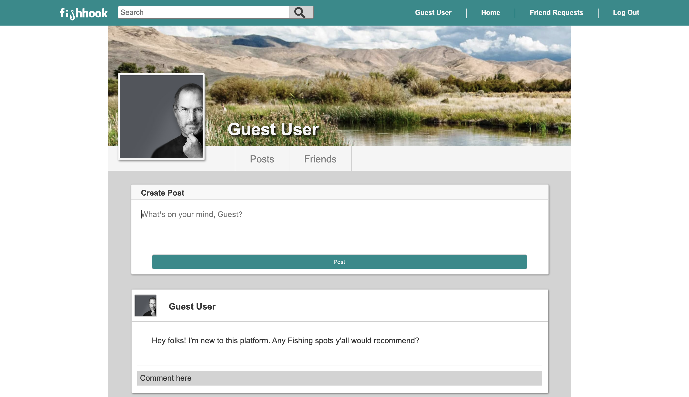

# [Fishhook](https://fish-hook.herokuapp.com/#/)

Fishhook is a social media app specifically taylored for the worldwide community of fishing enthusiasts. On Fishhook, you can discover new fishing spots, share your best catches, and connect with fellow fishermen and fisherwomen! Fishhook is built with a **Ruby on Rails backend, a PostgreSQL database and a React / Redux frontend.**

## Features

   **Friendships**
  - On Fishhook, users can send "friend requests" to other users which can be accepted or declined. "Friendships" on Fishhook are mutual, meaning that one user cannot be friends with another user if that user doesn't accept their friend request. 
  - Enabling this feature is a dynamic and robust system of database associations that were implimented with Rails ORM. A "friend request" is represented as an entry in a SQL joins table, with a default status of "pending". 
  - If a user accepts a "friend request", this status is changed to "accepted" and the "friend request" becomes in effect a "friendship" association between the two associated users. 
  - When a user rejects a "friend request", the joins table entry is simply deleted from the database, allowing either user to submit another friend request if they would like. 
  

  
  **Feed**
  - The main purpose of Fishhook is to enable users to share fishing-related content with their friends. The primary component of Fishhook is the "feed". 
  - When on the home page (assuming you are signed in) you will see all of the posts and activity of your Fishhook friends! Underlying this is a Rails ORM filtering system that leverages a user's "friendships" associations to only fetch content that is relevant to them. Feed is sorted chronologically, with the newest posts appearing first.
  - If you navigate to a user's profile page, you will see their "user feed" component. This displays the posts and activities of a particular user (assuming that their profile is public). Deciding if you should accept a friend request? Scroll through that user's feed and see how they might be connected to you. 
  
  
